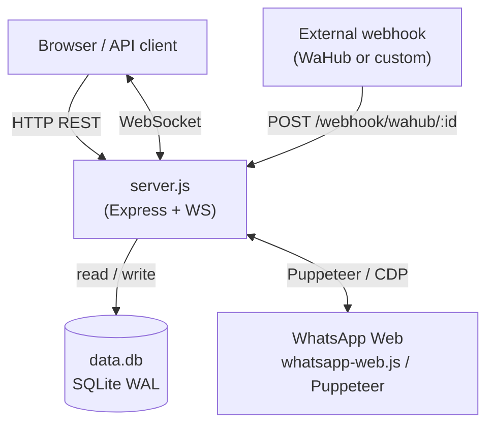

# Architecture

## Overview

WhatsApp Multi-Instance Manager runs as a single Node.js process (ES modules). It manages one or more `whatsapp-web.js` sessions, exposes a REST + WebSocket API, and serves a Svelte SPA. All persistent state lives in a single SQLite file.

**Tech stack:** Node.js 18+, Express 4, `whatsapp-web.js` (Puppeteer), `better-sqlite3`, `ws`, `express-session`, Svelte (Vite build)

---

## Component Map

```
server.js          Main process — HTTP server, WebSocket server, WhatsApp lifecycle
db.js              All SQLite access (schema init, queries, migrations)
ui/src/            Svelte SPA built to ui/dist/ and served statically
data.db            SQLite database (WAL mode)
instances.json     Flat list of instance IDs persisted across restarts
.wwebjs_auth/      LocalAuth session files created by whatsapp-web.js per instance
```

---

## System Diagram



---

## In-Memory State

Two Maps are the runtime source of truth for live instances:

```
whatsappInstances   Map<instanceId, { client, status, qr, linkedAccount, … }>
instanceClients     Map<instanceId, Set<WebSocket>>
```

`instances.json` is a flat array of instance IDs loaded on startup to recreate instances after a restart. Instance metadata (status, linked account) is re-derived from the live `Client` or from `instance_linked_accounts` in the DB.

---

## Request Lifecycle

### REST endpoint

```
HTTP request
  → CORS middleware
  → express-session (cookie parse + session load)
  → JSON body parser
  → route handler
      → requireAuth / requireAdmin / requireInstanceAccess
          → session check  OR  X-API-Key header lookup in DB
      → business logic
      → DB read/write
  → JSON response
```

### WebSocket upgrade

```
HTTP upgrade request
  → session middleware (session attached to request)
  → wss.handleUpgrade()
  → connection handler
      → client sends { type: 'auth', apiKey? }
      → client sends { type: 'subscribe', instanceId }
          → session user checked for instance access  OR  apiKey matched
      → client added to instanceClients.get(instanceId)
```

---

## Data Flows

### Incoming message (native — WhatsApp app sends a message to this number)

```
whatsapp-web.js client.on('message')
  → classify kind (individual / group / status)
  → getChat() for group name
  → getContact() for sender display + number
  → db.insertMessage()       ← persisted (deduped on instance_id + message_id)
  → broadcastToInstance()    ← pushed to all WS subscribers for this instance
```

### Incoming message (webhook — WaHub POSTs to this server)

```
POST /webhook/wahub/:instanceId
  → requireWebhookAuth (API key must match instance)
  → optional HMAC-SHA256 signature check (WEBHOOK_SECRET)
  → normalizeWebhookMessage() (handles many payload shapes)
  → db.insertMessage()
  → broadcastToInstance()
```

### Outgoing message (send-message / send-file)

```
POST /api/instances/:id/send-message
  → requireInstanceAccess
  → resolveCheckedChatId()   ← verifies number exists on WhatsApp for @c.us JIDs
  → client.sendMessage()     ← returned messageId in response
```

### QR code flow

```
createAndInitializeInstance()
  → new Client({ LocalAuth })
  → client.initialize()
  → client.on('qr')     → QRCode.toDataURL()  → broadcastToInstance({ type: 'qr', qr: dataUrl })
  → client.on('ready')  → syncInstanceLinkedAccount()  → broadcastToInstance({ type: 'ready' })
```

---

## Authentication Model

| Route scope | Accepted auth |
|---|---|
| Public (`/api/login`, `/api/check-auth`) | None |
| Admin routes (instance CRUD, user management) | Session (role = admin) |
| Instance-scoped routes (send, messages, api-key) | Session with instance access **or** instance API key |
| Webhook endpoint | Instance API key only |
| WebSocket subscribe | Session (cookie on upgrade) **or** API key (first WS message) |

API keys are 32-byte random hex strings stored in `instance_api_keys`. Each key belongs to exactly one instance; a key cannot be used to access a different instance's routes.

---

## Instance Lifecycle

```
POST /api/instances  (admin)
  → validate instanceId (alphanumeric + hyphens, unique)
  → createAndInitializeInstance()
  → generate + store API key
  → append to instances.json

Server startup
  → loadInstanceNames() from instances.json
  → createAndInitializeInstance() for each
  → generate API key if missing

DELETE /api/instances/:id  (admin)
  → client.destroy()
  → remove from whatsappInstances + instanceClients
  → remove from instances.json
  → delete DB rows (api_key, linked_account, messages)
  → remove LocalAuth session directory
```

Statuses: `initializing` → `qr_ready` → `authenticated` → `ready` | `disconnected`

---

## Key Design Decisions

| Decision | Rationale |
|---|---|
| Single `server.js` monolith | Simple to run, easy to read; all lifecycle hooks in one place |
| SQLite with WAL mode | Zero-dependency persistence; WAL allows concurrent reads during writes |
| `instances.json` for instance list | Minimal; instance metadata is re-derived from live client on startup |
| `LocalAuth` (filesystem-based) | WhatsApp sessions survive process restarts without re-scanning QR |
| Per-instance API keys | Lets external services auth to exactly one instance; no cross-instance leakage |
| WebSocket on same HTTP server | Single port; session middleware reused on upgrade |
| `noServer: true` on WebSocketServer | Allows session middleware to run before WS upgrade accepts |
